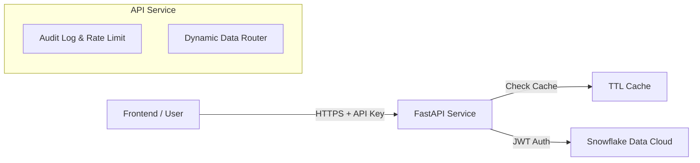

# ❄️ Snowflake Data Product API

**Developer**: Rikesh Chhetri
**Version**: 2.1.0


A high-performance, secure, and scalable REST API service that acts as a middleware between your Snowflake Data Cloud and frontend applications. Built with FastAPI, it provides dynamic data access, intelligent caching, rate limiting, and comprehensive audit logging.

---

## 🚀 Key Features

*   **Dynamic Data Router**: Expose any Snowflake table or view instantly via `registry.py` without writing new endpoint code.
*   **Zero-Trust Security**:
    *   JWT Keypair Authentication with Snowflake.
    *   API Key authentication for clients.
    *   Admin API for secure key generation.
*   **High Performance**:
    *   **In-Memory Caching (TTL)**: Frequently requested data is cached for 5 minutes (configurable) to reduce Snowflake costs and latency.
    *   **Async Streaming**: Handles large datasets efficiently using Python async generators and NDJSON format.
*   **Resilience**:
    *   **Rate Limiting**: Protects against abuse (e.g., 50 requests/minute per key).
    *   **Circuit Breaking**: Gracefully handles Snowflake connection failures.
*   **Observability**:
    *   **Audit Logging**: Tracks every request, including duration, client IP, and masked API key ID.
    *   **Structured Errors**: Returns clean, predictable JSON error responses with specific Snowflake error codes.

---

## 🛠️ Architecture

The API sits between the Client and Snowflake:



---

## 🏁 Getting Started

### Prerequisites
*   Python 3.12+
*   Docker (optional)
*   A Snowflake Account with Keypair Authentication configured.

### 1. Installation

Clone the repository:
```bash
git clone https://github.com/your-org/snowflake-python-api.git
cd snowflake-python-api
```

Create a virtual environment:
```bash
python -m venv venv
source venv/bin/activate  # On Windows: venv\Scripts\activate
pip install -r requirements.txt
```

### 2. Configuration

Create a `.env` file in the root directory:

```ini
APP_ENV=development
LOG_LEVEL=info

# Security
API_KEY=your-master-api-key-for-testing
ADMIN_SECRET=your-secure-admin-secret

# Pagination
DEFAULT_PAGE_LIMIT=10
MAX_PAGE_LIMIT=1000

# Snowflake Connection
SNOWFLAKE_ACCOUNT=your_account_identifier
SNOWFLAKE_USER=DATA_API_USER
SNOWFLAKE_ROLE=DATA_API_ROLE
SNOWFLAKE_WAREHOUSE=COMPUTE_WH
SNOWFLAKE_DATABASE=DATA_PRODUCT_DB
SNOWFLAKE_SCHEMA=PUBLIC
SNOWFLAKE_PRIVATE_KEY_PATH=rsa_key.p8
SNOWFLAKE_PRIVATE_KEY_PASSPHRASE=optional_passphrase
```

### 3. Running the Server

**Development:**
```bash
uvicorn app.main:app --reload
```
Access the Swagger UI at: `http://localhost:8000/docs`

**Production (Docker):**
```bash
docker build -t snowflake-api .
docker run -p 8000:8000 --env-file .env snowflake-api
```

---

## 📖 API Usage

### 1. Fetching Data with Filters
Use the dynamic endpoint to fetch data from any registered view.

**Endpoint:** `GET /v1/data/{view_id}`

**Generic Filtering:**
You can filter by **any column** in your Snowflake view by passing it as a query parameter.
*   `?product_id=123`
*   `?category=Electronics`
*   `?status=active`

**Testing in Swagger UI:**
Since Swagger UI doesn't allow adding custom query parameters easily, we've added helper fields:
*   `test_filter_col`: Enter the column name (e.g., `industry`)
*   `test_filter_val`: Enter the value (e.g., `Tech`)
These will simulate a filter like `?industry=Tech`.

**Testing with Postman:**
In Postman, you do **not** need the helper fields. Simply add your filters to the **Params** tab:
*   Key: `industry` | Value: `Tech`
*   Key: `status`   | Value: `Active`

**Example:** Fetch "companies" in the "Tech" industry.
```http
GET /v1/data/companies?industry=Tech&limit=5 HTTP/1.1
X-API-KEY: sk_12345...
```

**Response:**
```json
{
  "status": "success",
  "data": [
    {"id": 1, "name": "Tech Corp", "industry": "Tech", ...}
  ],
  "meta": {
    "total": 5,
    "limit": 5,
    "offset": 0
  }
}
```

### 2. Streaming Large Data
For large exports, use `stream=true` to receive data as newline-delimited JSON (NDJSON). This bypasses pagination limits and yields data directly from Snowflake partitions.

```http
GET /v1/data/companies?stream=true HTTP/1.1
X-API-KEY: sk_12345...
```

**Response (NDJSON):**
```json
{"id": 1, "name": "Company A"}
{"id": 2, "name": "Company B"}
...
```

### 3. Supported Views
The API is **Metadata Driven**. It automatically loads all views defined in `snowflake_view_list.txt` at startup.

*   **Automatic Slugs**: Tables are converted to kebab-case URLs.
    *   `AIRCRAFT_CARRIER_INDEX` -> `/v1/data/aircraft-carrier-index`
*   **Friendly Aliases**: Common views have short aliases:
    *   `companies` -> `COMPANY_INDEX`
    *   `fbi-crime` -> `FBI_CRIME_TIMESERIES`

### 4. Admin Operations
Generate a new API key for a client.

```bash
curl -X POST http://localhost:8000/v1/admin/generate-key \
  -H "X-ADMIN-SECRET: your-secure-admin-secret"
```

---

## ⚠️ Error Handling

The API returns standard HTTP status codes and consistent JSON error objects.

### Error Response Format
```json
{
  "status": "error",
  "code": "ERROR_CODE",
  "message": "Human readable error message.",
  "details": { ... } // Optional context
}
```

### Common Error Codes

| Status Code | Code | Description |
| :--- | :--- | :--- |
| `400 Bad Request` | `VALIDATION_ERROR` | Invalid parameters or query format. |
| `401 Unauthorized` | `Authentication Failed` | Missing or invalid `X-API-KEY`. |
| `404 Not Found` | `002003` | The requested data view was not found in Snowflake. |
| `429 Too Many Requests` | `RATE_LIMIT_EXCEEDED` | You have exceeded the 50 req/min limit. |
| `503 Service Unavailable` | `503` | Unable to connect to Snowflake or upstream service. |

---

## 👩‍💻 Development Guide

### Adding a New Dataset
You do **not** need to write new endpoint code.

1.  Open `app/registry.py`.
2.  Add your view mapping:
    ```python
    VIEW_ALLOWLIST = {
        "existing-view": "TABLE_NAME",
        "new-url-slug": "MY_SNOWFLAKE_TABLE_NAME"  # <--- Add this
    }
    ```
3.  Restart the server. The endpoint `/v1/data/new-url-slug` is now live with caching, rate limiting, and filtering enabled!

### Running Tests
We use `pytest` for comprehensive testing.

```bash
# Run all tests
pytest tests/

# Run with coverage
pytest --cov=app tests/
```

---

## 🔒 Security Best Practices

*   **Key Rotation**: Use the Admin API to generate unique keys for different clients.
*   **Least Privilege**: The Snowflake User should only have `SELECT` usage on the specific views exposed.
*   **HTTPS**: Always run behind a load balancer (like Nginx or AWS ALB) with SSL termination in production.

---

## 📄 License
MIT
